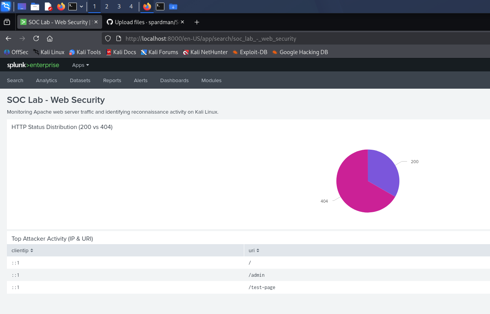

# Splunk SOC Lab: Web Security Monitoring on Kali Linux

## 🎯 Objective
To deploy a self-contained SIEM (Splunk Enterprise) environment on a Kali Linux VM to monitor web server traffic, identify reconnaissance patterns, and visualize security events in real-time.

## 🛠️ Tools & Technologies
*   **SIEM:** Splunk Enterprise (Free Perpetual License)
*   **OS:** Kali Linux (Debian-based)
*   **Web Server:** Apache2
*   **Languages:** SPL (Search Processing Language), Bash

## 🔍 Project Highlights
*   **Infrastructure Setup:** Successfully installed and configured Splunk Enterprise on a Linux VM, overcoming Python dependency and root-user permission hurdles.
*   **Data Ingestion:** Configured automated monitoring of Apache `access.log` with custom `access_combined` sourcetypes.
*   **Threat Detection:** Developed SPL queries to isolate `404 Not Found` errors, identifying directory-brute-forcing and reconnaissance activity.
*   **Visualization:** Built a live security dashboard to correlate traffic status codes with source IP addresses and requested URIs.

## 📊 Dashboard Showcase

## 💡 Skills Demonstrated
*   Linux System Administration (Permissions, Service Management)
*   SIEM Configuration & Data Onboarding
*   Security Log Analysis & Threat Hunting
*   Data Visualization & Reporting
# SOC-Lab-Splunk-Kali
